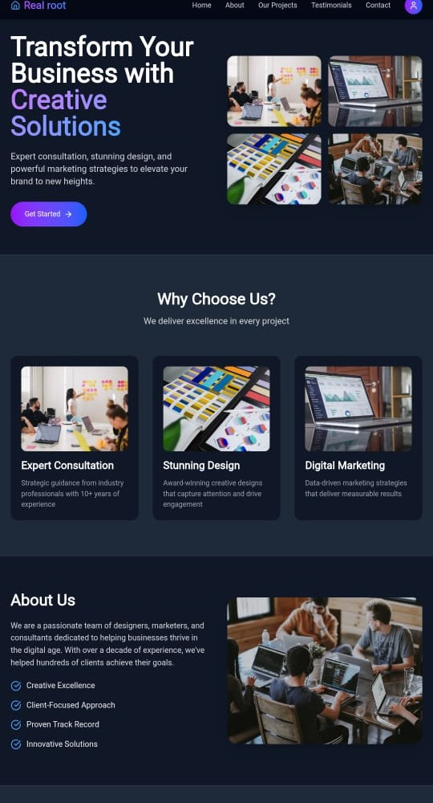

# Real Root – Creative Business Solutions



## 🚀 Live Demo  
🔗 **https://real-root.vercel.app/**

---

## 📝 Overview  
**Real Root** is a modern, responsive, and visually appealing website created to help businesses grow through powerful branding, creative design, and digital marketing services.

The interface is clean, professional, and fully optimized for all screen sizes, making it ideal for agencies, freelancers, and companies showcasing their services.

---

## 🌟 Features  
- ⚡ Modern Hero Section with CTA  
- 🧩 “Why Choose Us” section with service cards  
- 🧑‍💼 Professional “About Us” section  
- 📱 Fully responsive layout (mobile/tablet/desktop)  
- 🎨 Beautiful UI with gradient accents  
- 🔄 Smooth navigation and clean component structure  

---

## 🛠 Tech Stack  
- **React.js** – Frontend  
- **Tailwind CSS** – Styling  
- **Firebase (Future Ready)** – Backend services  
- **Vercel** – Deployment  
- **JavaScript (ES6+)**

---


## 📦 Installation & Setup  
```bash
# Clone repository
git clone <repository-url>

# Go inside project
cd real-root

# Install dependencies
npm install

# Start development server
npm run dev

